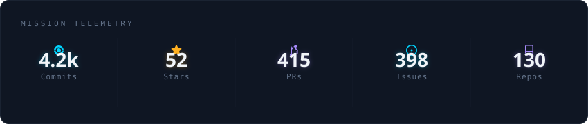

  
  
  
  
  
  

 

  

 

## About Me

I help shape the open standards behind user-owned identity as a working-group member at the W3C ([DIDs](https://www.w3.org/groups/wg/did/former-participants/), WebAuthn, [WebAssembly](https://www.w3.org/groups/wg/wasm/former-participants/)) and the Decentralized Identity Foundation (UCAN, DWN). I've been shipping software since age 12 — three apps with over 1M downloads, technical writing read 120k+ times, and bylines in Fast Company.

  

 

  

 

  

 

